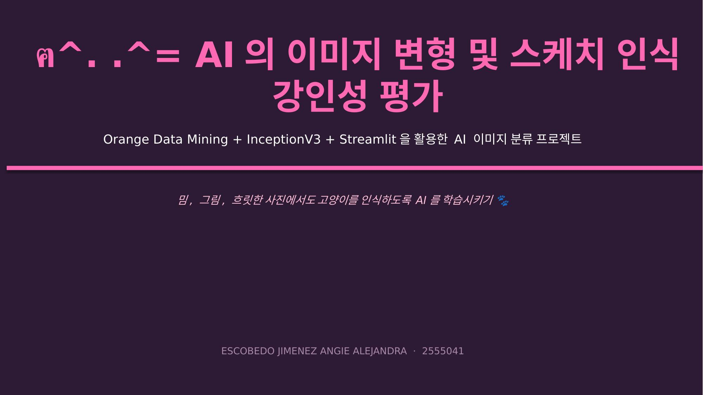
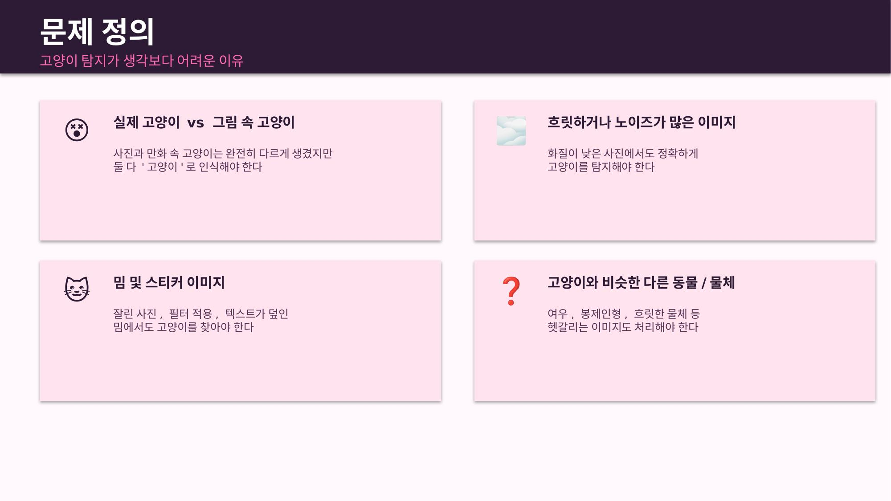
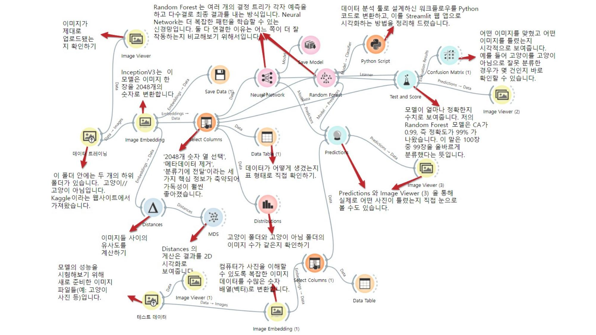
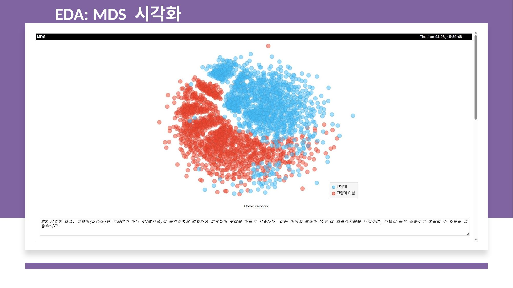
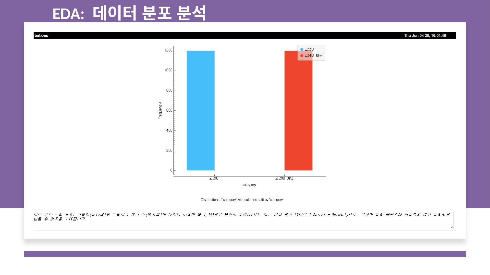
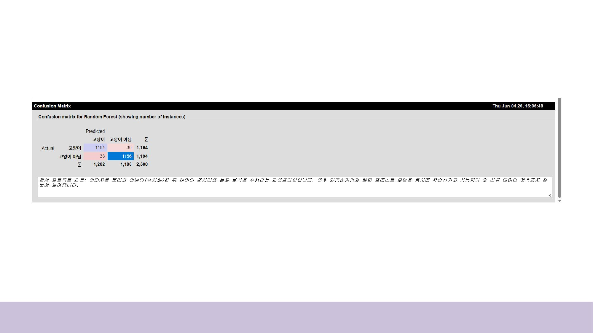
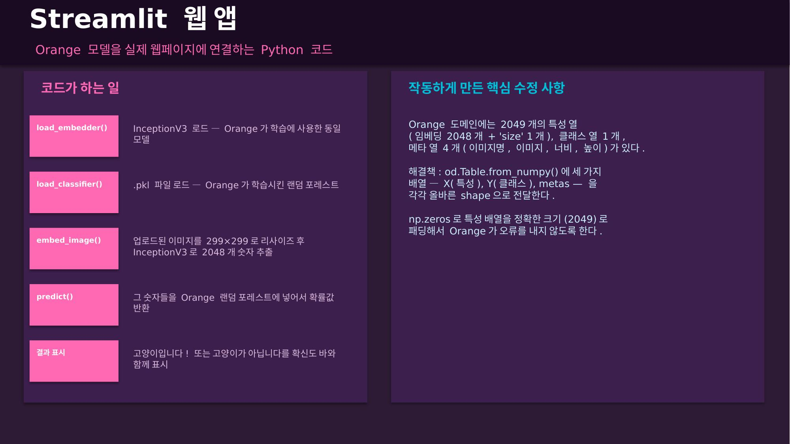
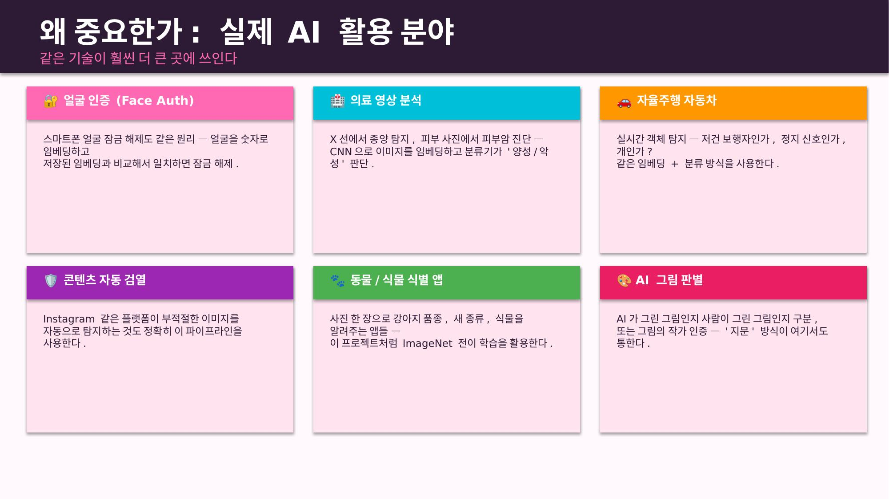
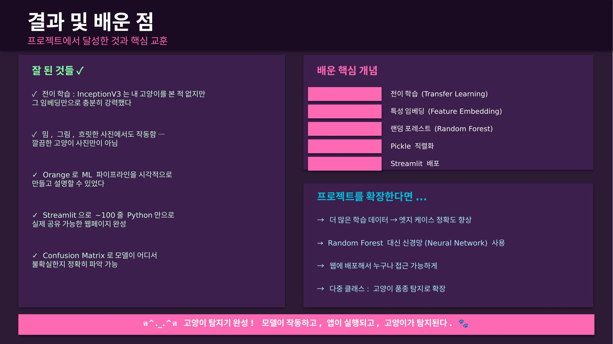

# ฅ^. .^= AI 고양이 탐지기 🐾
**2555041 · ESCOBEDO JIMENEZ ANGIE ALEJANDRA · 2학년 A · 인공지능개론**

> Cat detector AI that recognizes cats in memes, sketches, blurry and filtered images — built with Orange Data Mining + InceptionV3 + Streamlit.

---

